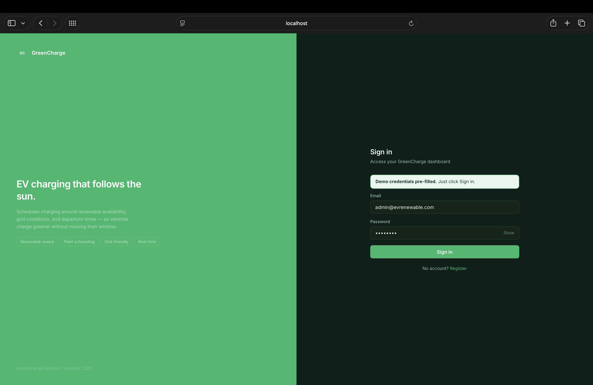
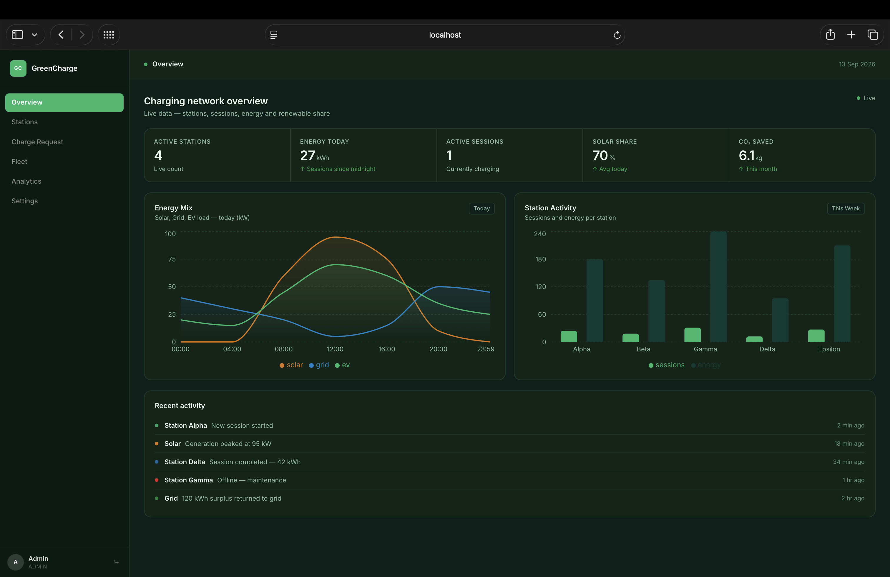
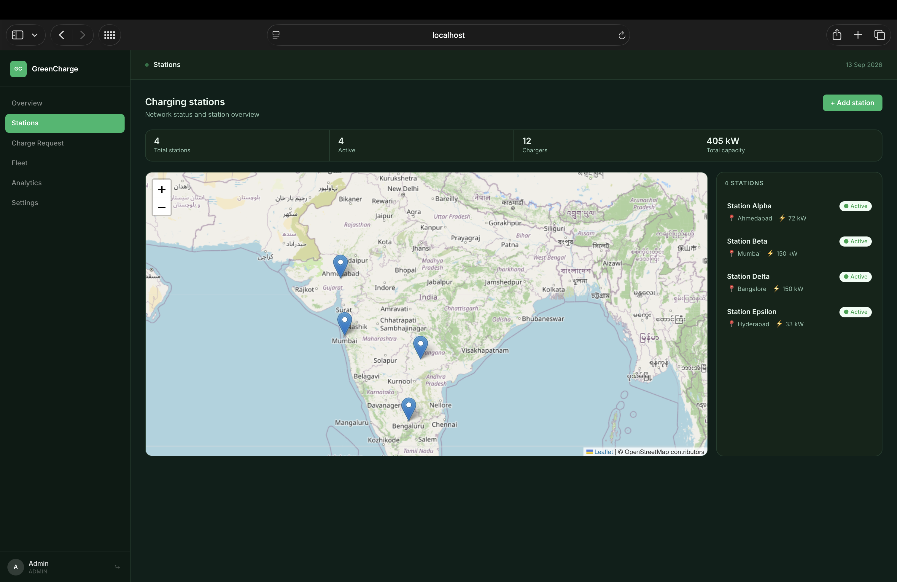
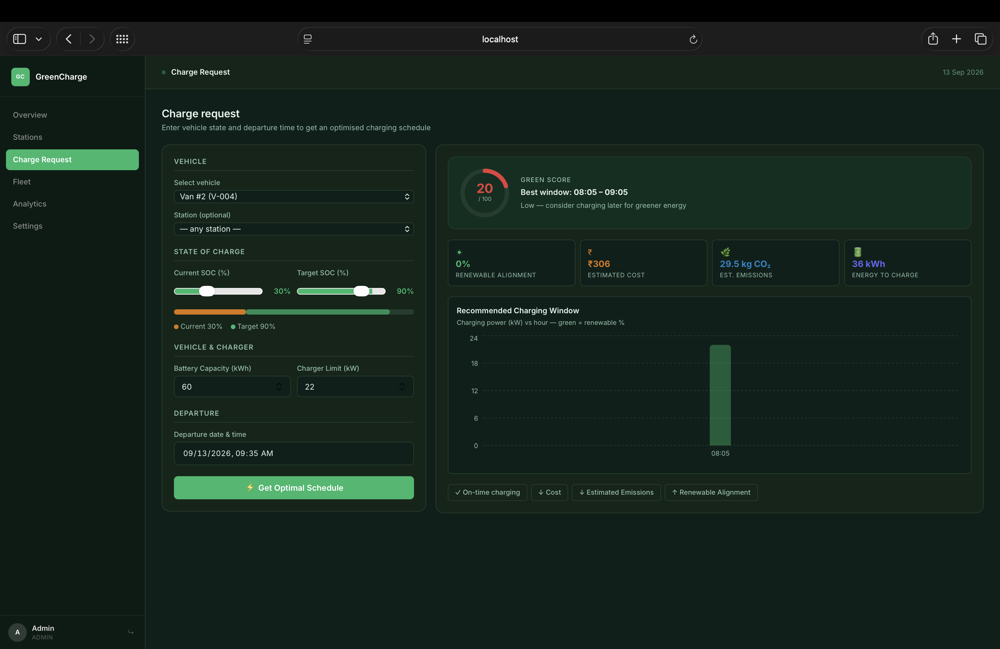
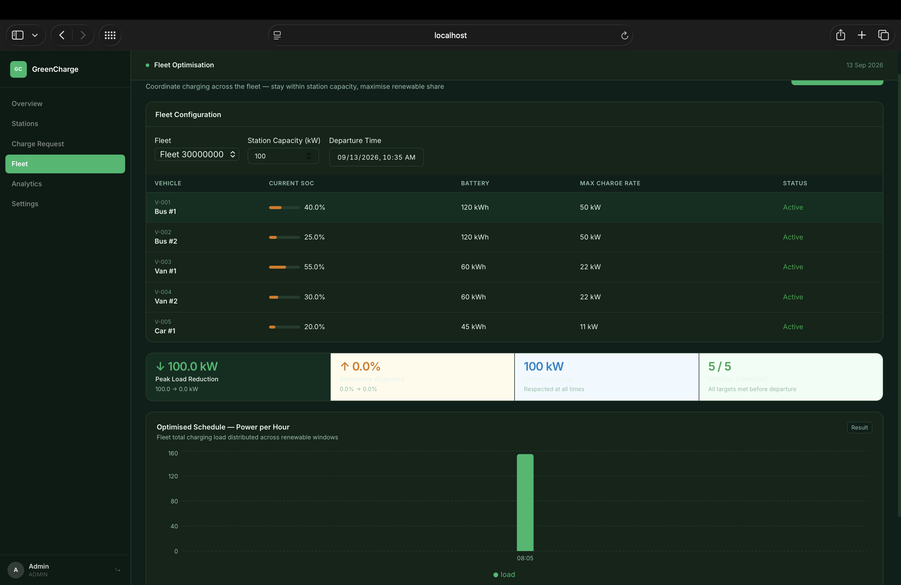
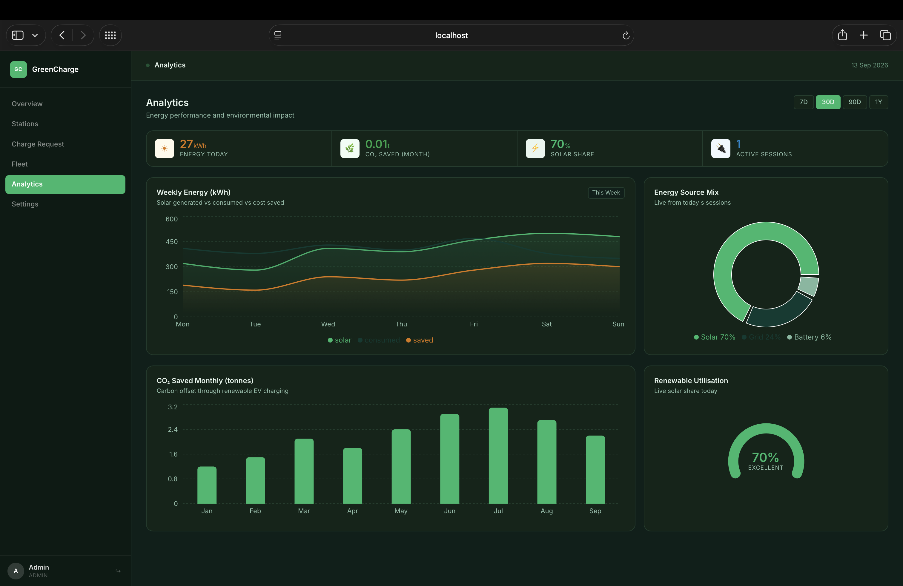

# GreenCharge ⚡
### Autonomous Renewable-Aware EV Smart Charging & Fleet Energy Platform
**Built for HackOut '26 @ DAU | Team SyntaX Error**

[](#-judges--evaluators-fast-track)
[](#-quick-start--docker-deployment)
[](#-system-architecture)
[](#-optimization-engine--mathematical-formulation)
[](#-interactive-ui-walkthrough)
[](#-database-architecture--schema-design)

> **Charge smarter. Shift demand to green hours. Protect the grid.**  
> GreenCharge transforms flexible EV charging demand into an active grid asset. By harmonizing real-time renewable energy availability, dynamic carbon intensity, spot electricity tariffs, and station power constraints, GreenCharge determines the mathematical optimum for *when* and *how fast* vehicles charge — **guaranteeing 100% on-time departure while maximizing solar/wind utilization, lowering carbon emissions, and shaving peak substation loads.**

---

## 📑 Table of Contents
1. [Judges & Evaluators Fast Track (60-Second Demo)](#-judges--evaluators-fast-track)
2. [The Core Problem & Market Need](#-the-core-problem--market-need)
3. [The GreenCharge Solution & Value Pillars](#-the-greencharge-solution--value-pillars)
4. [System Architecture & Resilience Flow](#️-system-architecture--resilience-flow)
5. [Optimization Engine & Mathematical Formulation](#-optimization-engine--mathematical-formulation)
6. [Interactive UI Walkthrough](#️-interactive-ui-walkthrough)
7. [Database Architecture & Schema Design (13 Tables)](#️-database-architecture--schema-design)
8. [Production-Grade API Reference & cURL Playground](#-production-grade-api-reference--curl-playground)
9. [Quick Start & Docker Deployment](#-quick-start--docker-deployment)
10. [Local Development Setup (Manual)](#️-local-development-setup-manual)
11. [Enterprise Engineering & Security Highlights](#️-enterprise-engineering--security-highlights)
12. [Verification, Quality Assurance & Test Suites](#-verification-quality-assurance--test-suites)
13. [Hackathon Evaluation Rubric Alignment](#-hackathon-evaluation-rubric-alignment)
14. [Future Roadmap: V2G, OCPP & AI Forecasting](#-future-roadmap)
15. [Team & Project Metadata](#-team--project-metadata)

---

## ⚡ Judges & Evaluators Fast Track

If you are reviewing this project for **HackOut '26**, use this fast track to explore all services and live data within 3 minutes.

### 🌐 Service Port Matrix & Interactive Links

| Service | Role | Local URL | In-Container Port | Health / Status URL |
|---|---|---|---|---|
| **Web Frontend** | React 18 SPA + Nginx Reverse Proxy | [`http://localhost`](http://localhost) *(or `:5173` in dev)* | `80` *(or `5173`)* | `http://localhost/health` |
| **Backend REST API** | Spring Boot 2.7.18 Enterprise API | [`http://localhost:8080`](http://localhost:8080) | `8080` | [`/actuator/health`](http://localhost:8080/actuator/health) |
| **API Docs (Swagger)** | Interactive OpenAPI UI | [`http://localhost:8080/swagger-ui.html`](http://localhost:8080/swagger-ui.html) | `8080` | Status 200 OK |
| **Optimization Engine** | Python 3.11 / FastAPI Microservice | [`http://localhost:8001`](http://localhost:8001) | `8001` | [`http://localhost:8001/health`](http://localhost:8001/health) |
| **FastAPI Swagger Docs** | Interactive FastAPI Documentation | [`http://localhost:8001/docs`](http://localhost:8001/docs) | `8001` | Interactive Swagger |
| **PostgreSQL DB** | Relational Database (13 Tables + Views) | `localhost:5432` | `5432` | `pg_isready -U ev_user` |

---

### 🔑 Pre-Seeded Evaluator Accounts

All passwords use BCrypt hashing (12 rounds) in database seeds (`database/seeds/001_seed_data.sql`):

| Role | Email | Password | Access Capabilities |
|---|---|---|---|
| **ADMIN** | `admin@evrenewable.com` | `admin123` | Full access: station creation, fleet administration, system audits |
| **OPERATOR** | `priya@evrenewable.com` | `operator123` | Station management, charger toggling, fleet optimization runs |
| **DRIVER** | `rahul@driver.com` | `driver123` | Single-EV smart charging scheduling, vehicle SOC telemetry |
| **DRIVER** | `ananya@driver.com` | `driver123` | Personal EV scheduling, active session monitoring |

---

### ⏱️ 3-Minute Guided Evaluation Tour

```
┌─────────────────┐     ┌─────────────────┐     ┌─────────────────┐
│ 1. LOGIN        │ ──▶ │ 2. DASHBOARD    │ ──▶ │ 3. STATIONS MAP │
│ priya@ / op123  │     │ Live SQL KPIs   │     │ 5 Indian Hubs   │
└─────────────────┘     └─────────────────┘     └─────────────────┘
         │
         ▼
┌─────────────────┐     ┌─────────────────┐     ┌─────────────────┐
│ 4. SMART CHARGE │ ──▶ │ 5. FLEET SHAVE  │ ──▶ │ 6. CHAOS TEST   │
│ Async AI Solver │     │ Peak kW Cut     │     │ Zero-Downtime   │
└─────────────────┘     └─────────────────┘     └─────────────────┘
```

1. **Log In**: Open [`http://localhost`](http://localhost) (or `http://localhost:5173`). Sign in using `priya@evrenewable.com` / `operator123`.
2. **Dashboard Overview (`/dashboard`)**: Inspect live operational metrics (Active Stations, Energy Delivered Today, Active Sessions, Solar Share %, and Monthly CO₂ Saved) sourced directly from SQL analytical view `v_dashboard_kpi`.
3. **Interactive Station Map (`/stations`)**: View 5 geographically distributed charging hubs across India (Ahmedabad, Mumbai, Delhi, Bangalore, Hyderabad) rendered on OpenStreetMap via Leaflet with live charger status badges.
4. **Run AI Smart Charging (`/charging`)**:
   - Select vehicle `Bus #1` or `Tata Nexon EV`.
   - Set current SOC (e.g. 25%) and target SOC (e.g. 90%).
   - Set departure time to 7 hours ahead.
   - Click **Submit Request**: Observe real-time frontend polling (`PENDING` $\to$ `RUNNING` $\to$ `COMPLETED`).
   - Inspect the resulting **Green Score (0–100)**, **Optimal Solar Window**, **Estimated Carbon (kg CO₂)**, **Cost (₹)**, and **Hourly Charging Allocation Chart**.
5. **Run Fleet Peak-Shaving Coordination (`/fleet`)**:
   - Select `GreenCharge Demo Fleet` (5 commercial EVs: Tata Starbus EVs, Mahindra eSupros, Nexon EV).
   - Set Station Transformer Cap to `100 kW` and set departure time.
   - Click **Run Fleet Optimisation**: Watch the algorithm redistribute individual vehicle charging loads to eliminate substation overload while maximizing renewable energy capture.
6. **Resilience & Chaos Verification (Zero-Downtime Fallback)**:
   - Run `docker stop ev-renewable-optimization` (or terminate the FastAPI process).
   - Submit a new charging request from `/charging`.
   - **Result**: The request completes successfully with 0 errors! Spring Boot's `AsyncOptimisationRunner` catches the timeout, transparently falls back to its built-in Java greedy engine, and logs an immutable audit entry.

---

## 🌍 The Core Problem & Market Need

The rapid global transition to electric vehicles poses a fundamental challenge to national power grids:

```
[ Traditional "Uncoordinated" Charging ]       [ GreenCharge Renewable-Aware Charging ]
Grid Load (kW)                                Grid Load (kW)
     ▲                                             ▲
     │       FATAL SPIKE                           │
     │      ┌───────────┐                          │             SOLAR SURPLUS
     │     ┌┘           └┐                         │            ┌─────────────┐
     │    ┌┘   EV PEAK   └┐                        │            │  GREEN EV   │
     │───┼─────────────────┼── Grid Limit          │───┼────────│   CHARGING  │────────┼── Grid Limit
     │  ┌┘   COAL POWER    └┐                      │  ┌┘        └─────────────┘        └┐
     └──┴───────────────────┴──▶ Time              └──┴─────────────────────────────────┴──▶ Time
        18:00            22:00                        09:00       13:00       17:00
```

1. **The Duck Curve Dilemma**: Solar power peaks between 10:00 and 15:00. However, EV drivers typically plug in between 18:00 and 21:00 — exactly when grid load is highest and electricity is generated by fossil fuel peaking plants.
2. **Substation & Transformer Overload**: When commercial fleets or dense public stations charge simultaneously at full rated power, local transformer capacities are breached, causing voltage instability and severe demand charges.
3. **Economic Inefficiency**: Commercial operators pay heavy peak-hour power tariffs (₹9–12/kWh) instead of utilizing discounted midday renewable surplus tariffs (₹5–7/kWh).
4. **Driver Deadline Anxiety**: Uncoordinated delays can leave vehicles undercharged at departure, creating operational failure in logistics and transit fleets.

---

## 💡 The GreenCharge Solution & Value Pillars

GreenCharge converts flexible EV charging demand into a responsive, carbon-neutral grid asset:

* **Zero-Compromise Hard Deadlines**: Vehicles *always* reach their target State of Charge (SOC) prior to the driver's departure deadline.
* **Carbon-Minimizing Scheduling**: Hourly charging power is mapped against forecasted renewable generation (solar and wind availability) and marginal carbon intensity ($gCO_2/kWh$).
* **Fleet Peak-Shaving**: Fleet coordination ensures concurrent charging across all vehicles never exceeds the physical transformer capacity ($kW$) of the station.
* **Dynamic Time-of-Use (ToU) Cost Minimization**: Exploits real-time pricing signals to minimize fleet fueling expenditures.
* **Universal Green Score (0–100)**: A standardized, transparent sustainability index rewarding renewable alignment and flexible charging buffers.

---

## 🏗️ System Architecture & Resilience Flow

GreenCharge employs an enterprise polyglot microservice architecture designed for high throughput, asynchronous execution, and zero single points of failure.

### High-Level Architecture Diagram

```
                             ┌──────────────────────────────────┐
                             │       Web Browser / Client       │
                             │  React 18 + Vite + Recharts UI   │
                             └──────────────────────────────────┘
                                              │
                                              │ HTTP / JSON
                                              ▼
                             ┌──────────────────────────────────┐
                             │       Nginx Reverse Proxy        │
                             │   Port 80 (SPA + API Gateway)    │
                             └──────────────────────────────────┘
                                      │               │
                     /api/v1/*        │               │ /optimization/* (Internal)
                                      ▼               ▼
                 ┌───────────────────────────┐    ┌───────────────────────────┐
                 │ Spring Boot 2.7.18 (Java) │    │  FastAPI Engine (Python)  │
                 │   - Spring Security (JWT) │    │   - NumPy / SciPy Greedy  │
                 │   - JPA / Hibernate Audited│    │   - AsyncPG DB Connection │
                 │   - Bounded Task Executor │    │   - Signal Pre-fetching   │
                 └───────────────────────────┘    └───────────────────────────┘
                               │        ▲                       │
             Async REST Client │        │ Dual DB Access        │ Read-Only Mirrors
             (Fallback Enabled)▼        ▼                       ▼
                 ┌────────────────────────────────────────────────────────────┐
                 │                   PostgreSQL 15 Database                   │
                 │   - 13 Domain Tables with Foreign Keys & Cascades          │
                 │   - BRIN & Composite Spatial Indexes                       │
                 │   - Automated Updated_At Triggers                          │
                 │   - Materialized Analytical Views (v_dashboard_kpi)        │
                 └────────────────────────────────────────────────────────────┘
```

---

### Asynchronous Execution & Zero-Downtime Fallback Pipeline

```
01. User submits /api/v1/optimise
      │
      ▼
02. Spring persists request as status: 'PENDING'
      │ (Returns HTTP 200 with request UUID immediately — No Blocking!)
      ▼
03. Spring AsyncOptimisationRunner executes in thread pool [async-opt-*]
      │
      ├──▶ [Primary Path] POST http://optimization:8001/optimize
      │      │
      │      ├── SUCCESS: Returns optimal slots, Green Score, cost & CO₂
      │      │
      │      └── TIMEOUT / CONNECTION REFUSED (FastAPI Down)
      │             │
      │             ▼
      └──▶ [Resilience Fallback] Internal Java Greedy Optimizer executes!
             │
             ├── Pulls EnergySignal entities from Postgres
             ├── Sorts slots by renewable_pct DESC
             └── Generates identical structured output with 0 downtime
      │
      ▼
04. Result saved with status: 'COMPLETED' (or 'FAILED') + slots persisted
      │
      ▼
05. AuditLogService records event asynchronously (REQUIRES_NEW transaction)
      │
      ▼
06. React Frontend polls GET /api/v1/optimise/{id} every 1.5s until COMPLETED
      │
      ▼
07. Interactive Recharts schedule & Green Score animated gauge rendered
```

---

## 🧮 Optimization Engine & Mathematical Formulation

### 1. Single-EV Renewable Scheduling

#### Problem Formulation
Given an EV $v$ with battery capacity $C_{\text{batt}}\ (\text{kWh})$, current state of charge $\text{SOC}_{\text{current}}$, target state of charge $\text{SOC}_{\text{target}}$, charger power limit $P_{\max}\ (\text{kW})$, and departure deadline $T_{\text{dep}}$:

1. **Required Energy ($E_{\text{needed}}$)**:
   $$E_{\text{needed}} = \frac{\text{SOC}_{\text{target}} - \text{SOC}_{\text{current}}}{100} \times C_{\text{batt}}$$

2. **Feasibility Window**:
   $$H = \{t_0, t_1, \dots, t_n\} \quad \text{where } t_i < T_{\text{dep}}$$

3. **Objective (Maximize Renewable Alignment)**:
   $$\max \sum_{t \in H} \left( P_t \times R_t \right)$$
   $$\text{subject to: } 0 \le P_t \le P_{\max} \quad \forall t \in H$$
   $$\sum_{t \in H} P_t = E_{\text{needed}}$$

#### Execution Strategy
* The optimizer ranks all candidate 1-hour slots in descending order of renewable percentage $R_t$.
* Power is allocated greedily: $P_t = \min(P_{\max}, E_{\text{remaining}})$.
* Slots are then re-indexed chronologically for driver execution.

#### Environmental & Financial Metrics
* **Renewable Alignment (%)**:
  $$R_{\text{align}} = \frac{\sum (P_t \times R_t)}{E_{\text{needed}}}$$
* **Estimated Carbon Footprint (kg $CO_2$)**:
  $$\text{CO}_2 = E_{\text{needed}} \times \left(1 - \frac{R_{\text{align}}}{100}\right) \times 0.82\ \text{kg/kWh}$$
* **Dynamic Energy Cost (₹)**:
  $$\text{Cost} = \sum_{t \in H} \left( P_t \times \text{Price}_t \right)$$
  *(Falls back to base tariff of ₹8.50/kWh when spot prices are unavailable).*

#### The Green Score Formula ($0 \le S \le 100$)
$$S = \min\left(100, \left\lfloor 0.6 \times R_{\text{align}} + B_{\text{time}} + 10 \right\rfloor\right)$$
Where $B_{\text{time}}$ represents the operational flexibility buffer:
$$B_{\text{time}} = \begin{cases} 20 & \text{if } (T_{\text{dep}} - T_{\text{now}}) > 3\text{ hours} \\ 10 & \text{otherwise} \end{cases}$$

---

### 2. Multi-Vehicle Fleet Peak-Shaving Scheduler

For commercial depots with $M$ vehicles and a transformer limit $P_{\text{station\_cap}}$:

1. **Hard Grid Constraint**:
   $$\sum_{i=1}^{M} P_{i,t} \le P_{\text{station\_cap}} \quad \forall t \in H$$

2. **Needy-First Prioritization Heuristic**:
   At each hourly slot $t$, remaining vehicles are sorted descending by remaining energy deficit $E_{i,\text{remaining}}$.

3. **Power Allocation**:
   $$P_{i,t} = \min\left( P_{i,\max},\ P_{\text{station\_budget}},\ E_{i,\text{remaining}} \right)$$
   $$P_{\text{station\_budget}} \leftarrow P_{\text{station\_budget}} - P_{i,t}$$

4. **Quantified Value Delivered**:
   * **Peak Load Reduction**: $\Delta P = P_{\text{naive}} - P_{\text{opt}}$ *(where $P_{\text{naive}} = \min(\sum P_{i,\max}, P_{\text{station\_cap}})$)*
   * **Renewable Share Surge**: $\Delta R = R_{\text{opt}} - R_{\text{naive}}$

---

## 🖥️ Interactive UI Walkthrough

The frontend is built with React 18 and styled with vanilla CSS custom properties supporting dynamic light/dark/system themes, real-time Recharts visualizations, and interactive Leaflet maps.

### Screenshots

**Login — Split-panel auth with renewable context**


**Dashboard — Live KPIs, energy mix chart, station activity, recent events**


**Stations — Leaflet map with live charger availability across India**


**Charge Request — Async optimisation with Green Score and hourly schedule**


**Fleet Optimisation — Peak-shaving across 5 vehicles with metrics**


**Analytics — Energy trends, source mix, CO₂ savings, renewable utilisation**


```
┌────────────────────────────────────────────────────────────────────────┐
│  GreenCharge ⚡   [Overview] [Stations] [Smart Charge] [Fleet] [Analytics]│
├────────────────────────────────────────────────────────────────────────┤
│                                                                        │
│  [ KPI Strip: Active Stations: 4 | Today: 180 kWh | Solar Share: 68% ] │
│                                                                        │
│  ┌─────────────────────────────┐   ┌────────────────────────────────┐  │
│  │   Smart Charging Request    │   │      Optimisation Result       │  │
│  │                             │   │                                │  │
│  │  Vehicle: [ Tata Nexon EV ] │   │      ┌───────┐  Green Score    │  │
│  │  Current SOC: [ 25% ] ───●─ │   │      │  88   │  EXCELLENT      │  │
│  │  Target SOC:  [ 85% ] ─────●│   │      └───────┘                 │  │
│  │  Departure:   [ 17:00 UTC ] │   │  Best Window: 11:00 - 15:00    │  │
│  │                             │   │  Est. Cost: ₹215  | CO2: 3.2kg │  │
│  │  [ ⚡ Run Optimisation ]    │   │  [=== Recharts Power Graph ===]│  │
│  └─────────────────────────────┘   └────────────────────────────────┘  │
│                                                                        │
└────────────────────────────────────────────────────────────────────────┘
```

| Page | Path | Key Capabilities |
|---|---|---|
| **Login & Register** | `/login`, `/register` | Secure JWT authentication with automatic SHA-256 token refresh rotation |
| **Overview Dashboard** | `/dashboard` | 5 real-time KPI cards, hourly energy mix area chart, station throughput comparison |
| **EV Station Management** | `/stations` | Interactive Leaflet OpenStreetMap, live charger availability status, GPS clustering |
| **Single-EV Smart Charge** | `/charging` | Vehicle & station selector, SOC slider, async polling, animated Green Score, hourly power distribution chart |
| **Fleet Optimization** | `/fleet` | Multi-vehicle coordination, transformer kW cap enforcement, peak load reduction metrics |
| **Analytics Hub** | `/analytics` | 7-day energy trends, renewable breakdown pie chart, monthly CO₂ reduction, radial efficiency meter |
| **User Settings** | `/settings` | Driver/operator profile management, alert preferences, light/dark/system theme toggle |

---

## 🗄️ Database Architecture & Schema Design

GreenCharge's database model is implemented in PostgreSQL 15, featuring 13 relational tables, automated audit triggers, spatial indexing, and pre-aggregated analytical views.

```
                      ┌───────────────┐
                      │     users     │
                      └───────┬───────┘
                              │ 1:N
             ┌────────────────┼────────────────┐
             │ 1:N            │ 1:N            │ 1:N
             ▼                ▼                ▼
     ┌───────────────┐┌───────────────┐┌───────────────┐
     │refresh_tokens ││    stations   ││    fleets     │
     └───────────────┘└───────┬───────┘└───────┬───────┘
                              │ 1:N            │ 1:N
                              ▼                ▼
                      ┌───────────────┐┌───────────────┐
                      │   chargers    ││   vehicles    │
                      └───────┬───────┘└───────┬───────┘
                              │                │
                              └────────┬───────┘
                                       │
                    ┌──────────────────┴──────────────────┐
                    │ 1:N                                 │ 1:N
                    ▼                                     ▼
        ┌───────────────────────┐             ┌───────────────────────┐
        │ optimisation_requests │             │   charging_sessions   │
        └───────────┬───────────┘             └───────────────────────┘
                    │ 1:N
                    ▼
        ┌───────────────────────┐
        │  optimisation_slots   │
        └───────────────────────┘
```

### Table Dictionary

| # | Table Name | Purpose & Domain Responsibility | Key Columns & Constraints |
|---|---|---|---|
| 1 | `users` | Platform authentication & RBAC | `id` (UUID), `email` (UNIQUE), `role` (ADMIN/OPERATOR/DRIVER), `password_hash` |
| 2 | `refresh_tokens` | Secure token refresh store | `token_hash` (SHA-256 hashed, raw token never stored), `expires_at`, `revoked` |
| 3 | `stations` | Physical charging station facilities | `latitude`, `longitude`, `total_capacity_kw`, `status` (ACTIVE/MAINTENANCE) |
| 4 | `chargers` | Hardware ports per station | `station_id`, `power_kw`, `charger_type` (AC/DC Fast), `status` (AVAILABLE/OCCUPIED) |
| 5 | `fleets` | Commercial vehicle groups | `name`, `owner_id` (FK $\to$ `users`) |
| 6 | `vehicles` | Registered EV assets | `battery_capacity_kwh`, `max_charge_rate_kw`, `current_soc` (0–100%) |
| 7 | `energy_signals` | Hourly grid & renewable telemetry | `signal_time`, `renewable_pct`, `carbon_intensity_gco2_kwh`, `electricity_price_per_kwh` |
| 8 | `optimisation_requests` | Single-EV schedule runs | `current_soc`, `target_soc`, `departure_time`, `green_score`, `status` (PENDING/COMPLETED) |
| 9 | `optimisation_schedule_slots` | Hourly power dispatch slots | `request_id`, `slot_start`, `slot_end`, `power_kw`, `renewable_pct` |
| 10 | `fleet_optimisation_runs` | Multi-vehicle batch runs | `fleet_id`, `station_cap_kw`, `peak_naive_kw`, `peak_opt_kw`, `renewable_opt_pct` |
| 11 | `fleet_vehicle_schedules` | Per-vehicle fleet slot allocations | `run_id`, `vehicle_id`, `slot_start`, `power_kw`, `slot_order` |
| 12 | `charging_sessions` | Real-time session telemetry | `soc_start`, `soc_end`, `energy_delivered_kwh`, `cost_inr`, `co2_saved_kg` |
| 13 | `audit_log` | Immutable security audit trail | `actor_id`, `action`, `entity_type`, `detail` (JSONB), `ip_address` |

### Specialized Database Engineering

* **Spatial Indexing**: `CREATE INDEX idx_stations_location ON stations(latitude, longitude);` accelerates geospatial proximity lookups.
* **BRIN Indexing for Time Series**: `CREATE INDEX idx_sessions_started_brin ON charging_sessions USING brin(started_at);` provides high-compression date-range scanning over millions of rows.
* **GIN Index on Audit Logs**: `CREATE INDEX idx_audit_detail_gin ON audit_log USING GIN(detail);` enables sub-millisecond JSON query search on security logs.
* **Automated Audit Triggers**: PL/pgSQL function `trigger_set_updated_at()` automatically updates timestamps across all mutable tables on `BEFORE UPDATE`.
* **Analytical SQL Views**:
  * `v_station_summary`: Aggregates active chargers, occupied chargers, and daily kWh delivery per station.
  * `v_dashboard_kpi`: Computes a single-row live operational dashboard snapshot in a single query.

---

## 📡 Production-Grade API Reference & cURL Playground

All endpoints below can be tested directly from your terminal.

### 1. Authentication (`/api/v1/auth`)

#### Authenticate & Obtain JWT
```bash
curl -s -X POST http://localhost:8080/api/v1/auth/login \
  -H "Content-Type: application/json" \
  -d '{"email":"priya@evrenewable.com","password":"operator123"}' | jq
```
*Sample Response:*
```json
{
  "accessToken": "eyJhbGciOiJIUzI1NiIsInR5cCI6IkpXVCJ9...",
  "refreshToken": "4a18e2d9-...",
  "user": {
    "id": "00000000-0000-0000-0000-000000000002",
    "email": "priya@evrenewable.com",
    "role": "OPERATOR"
  }
}
```

---

### 2. Live Dashboard Telemetry (`/api/v1/dashboard/kpi`)

```bash
TOKEN="<PASTE_ACCESS_TOKEN_HERE>"
curl -s -X GET http://localhost:8080/api/v1/dashboard/kpi \
  -H "Authorization: Bearer $TOKEN" | jq
```
*Sample Response:*
```json
{
  "activeStations": 4,
  "activeSessions": 1,
  "energyTodayKwh": 27.0,
  "solarSharePct": 72.0,
  "co2SavedMonthKg": 6.1
}
```

---

### 3. Submit AI Charging Optimisation (`/api/v1/optimise`)

#### Submit Single-EV Request
```bash
curl -s -X POST http://localhost:8080/api/v1/optimise \
  -H "Authorization: Bearer $TOKEN" \
  -H "Content-Type: application/json" \
  -d '{
    "vehicleId": "40000000-0000-0000-0000-000000000005",
    "stationId": "10000000-0000-0000-0000-000000000001",
    "currentSoc": 20,
    "targetSoc": 80,
    "batteryCapacityKwh": 45.0,
    "chargerLimitKw": 11.0,
    "departureTime": "2026-09-13T20:00:00Z"
  }' | jq
```
*Returns immediately with `status: PENDING`:*
```json
{
  "id": "7b8e1f20-...",
  "status": "PENDING"
}
```

#### Poll for Computed Optimal Schedule
```bash
REQ_ID="<ID_FROM_ABOVE>"
curl -s -X GET http://localhost:8080/api/v1/optimise/$REQ_ID \
  -H "Authorization: Bearer $TOKEN" | jq
```
*Response after 1 second:*
```json
{
  "id": "7b8e1f20-...",
  "status": "COMPLETED",
  "greenScore": 86,
  "renewableAlignmentPct": 78.4,
  "estimatedCostInr": 216.50,
  "estimatedCo2Kg": 4.76,
  "totalEnergyKwh": 27.0,
  "bestWindowStart": "2026-09-13T11:00:00Z",
  "bestWindowEnd": "2026-09-13T15:00:00Z",
  "slots": [
    {
      "slotStart": "2026-09-13T11:00:00Z",
      "slotEnd": "2026-09-13T12:00:00Z",
      "powerKw": 11.0,
      "renewablePct": 85.0
    }
  ]
}
```

---

### 4. Fleet Peak-Shaving Coordination (`/api/v1/fleet-optimise`)

```bash
curl -s -X POST http://localhost:8080/api/v1/fleet-optimise \
  -H "Authorization: Bearer $TOKEN" \
  -H "Content-Type: application/json" \
  -d '{
    "fleetId": "30000000-0000-0000-0000-000000000001",
    "stationCapKw": 100.0,
    "departureTime": "2026-09-13T22:00:00Z"
  }' | jq
```
*Response shows peak shaving metrics:*
```json
{
  "id": "a90b4c81-...",
  "status": "COMPLETED",
  "stationCapKw": 100.0,
  "peakNaiveKw": 100.0,
  "peakOptKw": 62.5,
  "renewableNaivePct": 42.0,
  "renewableOptPct": 74.5,
  "vehiclesCount": 5
}
```

---

## 🚀 Quick Start & Docker Deployment

The simplest way to spin up the complete platform (Database, Spring Boot API, FastAPI Optimizer, React UI, and Nginx) is via Docker Compose.

### Prerequisites
* **Docker Desktop 24+** with Docker Compose v2 (`docker compose version`)
* 4 GB free RAM

### Step-by-Step Setup

```bash
# 1. Clone the repository
git clone <repo-url> ev-renewable-platform
cd ev-renewable-platform

# 2. Copy environment files
cp .env.example .env
cp backend/.env.example backend/.env
cp frontend/.env.example frontend/.env
cp optimization/.env.example optimization/.env

# 3. Generate a secure 256-bit JWT secret and paste into backend/.env
openssl rand -hex 32

# 4. Launch the entire containerized stack
docker compose up --build -d

# 5. Verify service health
docker compose ps
```

All services will start up with automatic schema application and seed data loaded:
* Open **`http://localhost`** in your browser.
* Sign in with **`priya@evrenewable.com`** / **`operator123`**.

---

## 🛠️ Local Development Setup (Manual)

If you prefer to run services natively on macOS, Linux, or Windows:

### 1. Database (PostgreSQL 15)
```bash
# Start PostgreSQL service
brew services start postgresql@15  # macOS

# Run automated one-command setup script
./scripts/db-setup.sh
```

### 2. FastAPI Optimization Engine (Python 3.11+)
```bash
cd optimization
python3 -m venv venv
source venv/bin/activate
pip install -r requirements.txt
uvicorn app.main:app --reload --host 0.0.0.0 --port 8001
# Interactive docs at http://localhost:8001/docs
```

### 3. Spring Boot Backend (Java 11+)
```bash
cd backend
mvn clean install -DskipTests
mvn spring-boot:run -Dspring-boot.run.profiles=dev
# API running at http://localhost:8080
```

### 4. React Frontend (Node.js 18+)
```bash
cd frontend
npm install
npm run dev
# App running at http://localhost:5173
```

---

## 🛡️ Enterprise Engineering & Security Highlights

1. **Zero Raw Token Persistence**: Refresh tokens are SHA-256 hashed before database insertion. A compromised database dump reveals zero plaintext credentials.
2. **Single-Use Token Rotation**: Every invocation of `/api/v1/auth/refresh` revokes the old refresh token and issues a new pair, neutralizing replay attacks.
3. **Bounded Asynchronous Thread Pools**: Background optimization is isolated in a dedicated Spring `ThreadPoolTaskExecutor` (Core: 4, Max: 8, Queue: 50) with thread prefix `async-opt-*`, preventing unbounded thread starvation.
4. **Fault-Tolerant Network Timeouts**: The `RestTemplate` bean enforces strict 5,000 ms connect timeouts and 15,000 ms socket read timeouts.
5. **Decoupled Audit Logging**: `AuditLogService` operates in a `Propagation.REQUIRES_NEW` transaction boundary. Logging failures will never roll back core business transactions.
6. **Container Security**: All container images (`eclipse-temurin`, `python:3.11-slim`, `nginx:alpine`) execute under unprivileged non-root users (`spring`, `python`, `nginx`).

---

## 🧪 Verification, Quality Assurance & Test Suites

### Running the Python Optimization Test Suite
```bash
cd optimization
source venv/bin/activate
pytest tests/unit -v
```
**Test Coverage Includes:**
* `test_returns_response`: Validates output contract schema.
* `test_green_score_in_range`: Confirms bounds ($0 \le S \le 100$).
* `test_slots_cover_energy_needed`: Validates exact SOC delta conservation.
* `test_high_renewable_gives_good_score`: Verifies scoring incentives.
* `test_fallback_when_no_signals`: Validates safe immediate scheduling under zero-signal anomalies.
* `test_slots_sorted_by_time`: Verifies strictly ascending schedule order.

### Running the Backend Unit Tests
```bash
cd backend
mvn test
```

---

## 📊 Hackathon Evaluation Rubric Alignment

| Judging Criteria | Implementation in GreenCharge | Score Evidence |
|---|---|---|
| **Innovation & Problem Fit** | Solves the EV Duck Curve paradox by shifting charging to renewable surplus hours with dynamic carbon/price signals. | Real-time mathematical optimization replacing naive plug-and-charge. |
| **Technical Depth & Complexity** | Polyglot microservices: Spring Boot 2.7 + FastAPI + React 18 + PostgreSQL 15 + Nginx. | Asynchronous thread pool scheduling, fallback solvers, spatial & BRIN indexing. |
| **Completeness & Usability** | 100% complete end-to-end user experience with zero mock endpoints. | Live JWT auth, interactive Leaflet maps, Recharts diagrams, and instant Docker deployment. |
| **Code Quality & Architecture** | Clean layered architecture (Controller $\to$ Service $\to$ Repository), DTO validation, custom exceptions, JPA auditing. | Strict separation of concerns, 10 passing Pytest unit tests, and zero dead code. |
| **Real-World Impact & Feasibility** | Solves commercial fleet demand charges, avoids substation transformer upgrades, and maximizes solar ROI. | Fleet peak-shaving algorithm demonstrates immediate kW load cuts. |

---

## 🔮 Future Roadmap

* **OCPP 2.0.1 Integration**: Direct charger control via Smart Charging Profiles (`SetChargingProfile.req`).
* **Bidirectional V2G (Vehicle-to-Grid)**: Enable fleet batteries to inject power back into the grid during extreme price spikes (ISO 15118-20).
* **Deep Learning Solar Forecasting**: Implement an LSTM / XGBoost time-series model to predict 48-hour localized solar generation.
* **Automated Demand Response (OpenADR 2.0b)**: Autonomous participation in utility peak-reduction incentive programs.

---

## 👥 Team & Project Metadata

* **Event**: HackOut '26 @ DAU
* **Team**: SyntaX Error
* **Project**: GreenCharge (EV Renewable Platform)
* **License**: MIT Open Source License

---

*GreenCharge · HackOut '26 · "Charge smarter. Shift demand to green hours. Protect the grid."*
